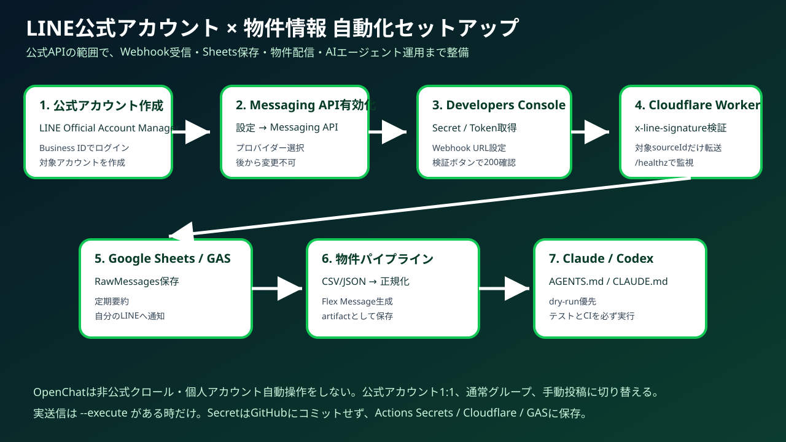
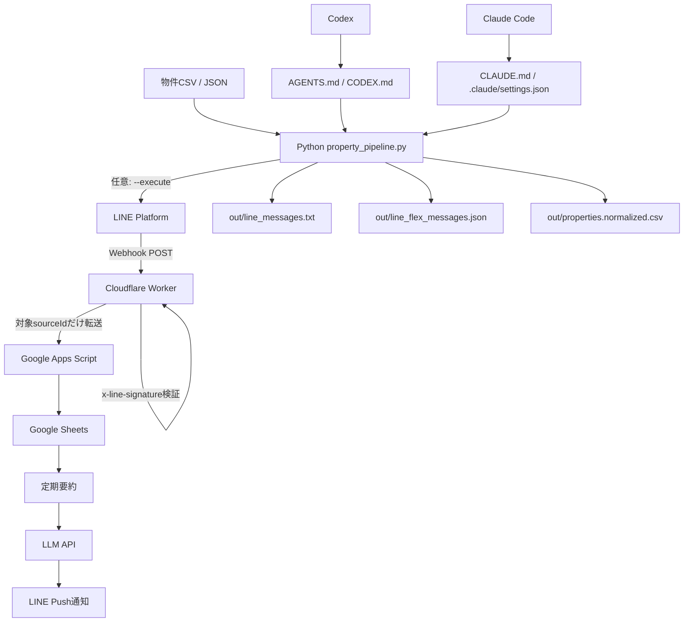

# LINE Sheet Digest + Property Automation



LINE公式アカウントのMessaging APIを安全に使い、Webhook受信、Google Sheets保存、要約通知、物件情報CSV/JSONのLINE配信用メッセージ化まで行う自動化テンプレートです。

このREADMEだけで、最初の導入、LINE公式アカウント設定、Webhook設定、Secret設定、物件情報の生成、Claude Code / Codexへの作業依頼まで一通り進められるようにまとめています。

> 重要: このリポジトリはLINEの公式APIで許可される範囲だけを対象にします。LINEオープンチャットを非公式にクロールしたり、通常のLINE個人アカウントを自動操作して投稿・収集する用途は対象外です。

---

## まず結論

### このリポジトリでできること

- LINE Messaging API WebhookをCloudflare Workerで署名検証して受信
- 対象の `userId` / `groupId` / `roomId` だけをGoogle Apps Scriptへ転送
- Google SheetsへRawログ保存
- 必要に応じて定期要約し、自分のLINEへ通知
- 物件情報CSV/JSONを正規化
- LINE配信用テキストを生成
- LINE Flex Message JSONを生成
- 正規化済みCSVを生成
- LINE公式アカウントAPIの疎通確認、Bot情報取得、push、broadcastのdry-run/実行
- Claude Code / Codex用の作業ルールを同梱
- GitHub Actionsでテストとサンプル物件成果物を自動生成

### このリポジトリでやらないこと

- LINE個人アカウントへの自動ログイン
- LINEアプリやブラウザセッションの自動操作
- OpenChatの非公式クロール
- OpenChatへの非公式自動投稿
- 規約回避やレート制限回避
- Secret値のGitHubコミット

OpenChatへ物件情報を流したい場合は、このリポジトリで `out/line_messages.txt` を生成し、人間が確認して手動投稿する運用にしてください。公式アカウントの1:1チャット、通常グループ、複数人トークを使う方が自動化しやすい構成です。

---

## 全体構成



---

## 最初に見る場所

| 目的 | ファイル |
|---|---|
| LINE API調査結果 | `docs/LINE_API_RESEARCH_ja.md` |
| 初期設定の詳細 | `docs/SETUP_LINE_ja.md` |
| 画像付きセットアップ | `docs/VISUAL_SETUP_GUIDE_ja.md` |
| 物件情報自動化 | `docs/PROPERTY_AUTOMATION_ja.md` |
| Claude / Codex運用 | `docs/AGENT_GUIDE_ja.md` |
| 全体設計 | `docs/architecture.md` |
| Codex向けルール | `AGENTS.md` / `CODEX.md` |
| Claude Code向けルール | `CLAUDE.md` / `.claude/settings.json` |

---

# 初期導入手順

## 0. 必要なアカウント

以下を用意します。

- GitHubアカウント
- LINE Business ID
- LINE公式アカウント
- LINE Developers Consoleへアクセスできる権限
- Cloudflareアカウント
- Googleアカウント
- Google Sheets
- Google Apps Script
- 必要に応じてOpenAI API KeyなどのLLM API Key

---

## 1. リポジトリを開く

GitHubでこのリポジトリを開きます。

```text
https://github.com/univcorp2-ctrl/line-sheet-digest
```

Codespacesを使う場合はこちらです。

```text
https://github.com/codespaces/new?hide_repo_select=true&ref=main&repo=1245154250
```

ローカルで作業する場合:

```bash
git clone https://github.com/univcorp2-ctrl/line-sheet-digest.git
cd line-sheet-digest
```

---

## 2. Python / Node環境を確認する

推奨:

- Python 3.12
- Node.js 20

Codespacesを使う場合は `.devcontainer/devcontainer.json` により自動で用意されます。

ローカル確認:

```bash
python --version
node --version
```

---

## 3. LINE公式アカウントを作成する

1. LINE Official Account Managerへアクセスします。
2. LINE Business IDでログインします。
3. `アカウントを作成` を選びます。
4. アカウント名、業種、会社情報などを入力します。
5. 作成後、対象アカウントの管理画面を開きます。

この時点では、まだAPI連携は完了していません。次にMessaging APIを有効化します。

---

## 4. Messaging APIを有効化する

1. LINE Official Account Managerで対象アカウントを開きます。
2. 左側メニューまたは設定画面から `設定` を開きます。
3. `Messaging API` を開きます。
4. `Messaging APIを利用する` を選びます。
5. プロバイダーを選択、または新規作成します。
6. 確認して有効化します。

注意: プロバイダーは後から変更しにくいため、個人検証用と本番会社用を混ぜないようにしてください。

---

## 5. LINE Developers Consoleで値を取得する

Messaging APIを有効化すると、LINE Developers ConsoleにMessaging APIチャネルが作成されます。

1. LINE Developers Consoleを開きます。
2. 対象プロバイダーを選びます。
3. 対象のMessaging APIチャネルを開きます。
4. `チャネル基本設定` で `Channel secret` をコピーします。
5. `Messaging API設定` で `Channel access token` を発行してコピーします。
6. `Webhook URL` は後でCloudflare WorkerのURLを設定します。

取得する値:

```text
LINE_CHANNEL_SECRET
LINE_CHANNEL_ACCESS_TOKEN
```

この2つは絶対にGitHubへ直接書かないでください。

---

## 6. Google Sheetsを用意する

Webhookイベントや要約結果を保存するためのGoogle Sheetsを作成します。

推奨シート:

```text
RawMessages
DigestLogs
Settings
```

最低限 `RawMessages` があれば、LINEから届いたイベントを保存できます。

取得する値:

```text
GOOGLE_SHEET_ID
```

Google SheetsのURLが以下の形なら、`/d/` と `/edit` の間がSpreadsheet IDです。

```text
https://docs.google.com/spreadsheets/d/<GOOGLE_SHEET_ID>/edit
```

---

## 7. Google Apps Scriptを設定する

既存の `gas/Code.gs` をGoogle Apps Scriptに貼り付け、Webアプリとしてデプロイします。

基本手順:

1. Google Sheetsを開きます。
2. `拡張機能` → `Apps Script` を開きます。
3. `gas/Code.gs` の内容を貼り付けます。
4. Script Propertiesに必要なSecretを設定します。
5. `デプロイ` → `新しいデプロイ` を選びます。
6. 種類は `ウェブアプリ` を選びます。
7. 実行ユーザーは自分、アクセス権は構成に応じて設定します。
8. デプロイURLをコピーします。

取得する値:

```text
GAS_WEB_APP_URL
```

---

## 8. Cloudflare Workerを設定する

Cloudflare Workerは、LINEからのWebhookを受け、署名検証してからGoogle Apps Scriptへ転送します。

設定するSecret:

```text
LINE_CHANNEL_SECRET
GAS_WEB_APP_URL
FORWARD_SHARED_TOKEN
TARGET_SOURCE_IDS
```

`TARGET_SOURCE_IDS` は、許可する `userId` / `groupId` / `roomId` をカンマ区切りで設定します。最初は空で検証し、ログから対象IDを確認してから絞り込む運用でも構いません。

Cloudflare Workerのデプロイ後、Webhook URLは以下のようになります。

```text
https://<worker-name>.<account>.workers.dev/line-webhook
```

---

## 9. LINE Developers ConsoleにWebhook URLを登録する

1. LINE Developers Consoleを開きます。
2. 対象Messaging APIチャネルを開きます。
3. `Messaging API設定` を開きます。
4. `Webhook URL` にCloudflare WorkerのURLを入力します。
5. `Webhookの利用` をONにします。
6. `検証` を押します。
7. 成功すれば初期接続は完了です。

検証時、LINEは空イベントのPOSTを送ることがあります。その場合もサーバーはHTTP 200を返す必要があります。

---

## 10. LINE Official Account Managerの応答設定を確認する

Bot側で処理する場合は、以下を確認してください。

| 設定 | 推奨 |
|---|---|
| Webhook | ON |
| 応答メッセージ | Botで返信するならOFF推奨 |
| あいさつメッセージ | 必要に応じてON |
| グループ・複数人トーク参加 | グループで使う場合だけON |

---

## 11. GitHub Actions Secretsを設定する

GitHubのリポジトリ画面で以下を開きます。

```text
Settings → Secrets and variables → Actions → New repository secret
```

登録するSecret例:

```text
LINE_CHANNEL_ACCESS_TOKEN
LINE_CHANNEL_SECRET
LINE_DEFAULT_TO
GAS_WEB_APP_URL
FORWARD_SHARED_TOKEN
TARGET_SOURCE_IDS
OPENAI_API_KEY
GOOGLE_SHEET_ID
GOOGLE_SERVICE_ACCOUNT_JSON
```

Secretの実値はREADMEやコードに書かないでください。

---

## 12. ローカルまたはCodespacesで動作確認する

環境変数の確認:

```bash
python scripts/validate_env.py --mode local
```

Pythonテスト:

```bash
PYTHONPATH=src python -m unittest discover -s tests -p 'test_*.py'
```

Cloudflare Workerテスト:

```bash
cd cloudflare-worker
npm test
```

物件サンプル生成:

```bash
python scripts/property_pipeline.py --input data/sample_properties.csv --output out --format all
```

生成されるファイル:

```text
out/line_messages.txt
out/line_flex_messages.json
out/properties.normalized.csv
out/summary.txt
```

---

# 物件情報配信の始め方

## 1. CSVを用意する

`data/sample_properties.csv` と同じ形式で物件情報を用意します。

必須項目:

| 日本語列名 | 英語列名 |
|---|---|
| 物件名 | title |
| 賃料 | rent |
| 最寄駅 | station |
| 住所 | address |
| URL | url |

任意項目:

| 日本語列名 | 英語列名 |
|---|---|
| 間取り | layout |
| 面積 | area |
| 説明 | description |

サンプル:

```csv
物件名,賃料,最寄駅,住所,間取り,面積,URL,説明
青山サンプルレジデンス,18.5万円,表参道駅 徒歩7分,東京都港区南青山1-1-1,1LDK,42.3㎡,https://example.com/property/aoyama,ペット相談可・南向き
```

## 2. LINE配信用データを生成する

```bash
python scripts/property_pipeline.py --input data/sample_properties.csv --output out --format all
```

## 3. 生成内容を確認する

```bash
cat out/summary.txt
cat out/line_messages.txt
```

Flex Message JSONを使う場合:

```bash
cat out/line_flex_messages.json
```

## 4. dry-runで送信payloadを確認する

```bash
python scripts/property_pipeline.py --input data/sample_properties.csv --output out --send --to <userId_or_groupId>
```

`--execute` を付けない限り、実送信されません。

## 5. 実送信する

内容確認後、明示的に実行します。

```bash
LINE_DRY_RUN=false python scripts/property_pipeline.py --input data/sample_properties.csv --output out --send --to <userId_or_groupId> --execute
```

---

# LINE公式アカウントAPIの確認コマンド

Bot情報の確認 dry-run:

```bash
python scripts/line_oa.py bot-info
```

Bot情報の実取得:

```bash
LINE_DRY_RUN=false python scripts/line_oa.py --execute bot-info
```

メッセージ送信 dry-run:

```bash
python scripts/line_oa.py push-text --to <userId_or_groupId> --text "テスト送信"
```

メッセージ実送信:

```bash
LINE_DRY_RUN=false python scripts/line_oa.py --execute push-text --to <userId_or_groupId> --text "テスト送信"
```

OpenChat方針の確認:

```bash
python scripts/line_oa.py openchat-policy
```

---

# Claude Code / Codexに任せる準備

このリポジトリには、AIコーディングエージェント向けの指示を入れています。

## Codex

Codexには以下を読ませます。

```text
AGENTS.md
CODEX.md
```

依頼例:

```text
物件CSVを取り込んでLINE配信用Flex Messageを生成して。実送信はしないで。
```

```text
LINE公式アカウントのWebhookで物件問い合わせを受けたら、Google Sheetsに保存する処理を追加して。テストも更新して。
```

## Claude Code

Claude Codeには以下を読ませます。

```text
CLAUDE.md
.claude/settings.json
```

`.claude/settings.json` では、Secretファイルの読み取りや、直接の `curl api.line.me` 実行を制限する方針を入れています。

---

# GitHub Actions

このリポジトリの `validate` workflow は以下を行います。

- Cloudflare WorkerのNodeテスト
- Python syntax check
- Python unit test
- サンプル物件データから成果物生成
- `property-automation-outputs` artifact upload

Actions画面:

```text
https://github.com/univcorp2-ctrl/line-sheet-digest/actions
```

---

# 本番運用前チェックリスト

- [ ] LINE公式アカウントを作成した
- [ ] Messaging APIを有効化した
- [ ] Channel Secretを取得した
- [ ] Channel Access Tokenを発行した
- [ ] Cloudflare Workerをデプロイした
- [ ] LINE Developers ConsoleにWebhook URLを登録した
- [ ] Webhook検証が成功した
- [ ] Google Sheetsを作成した
- [ ] Google Apps Scriptをデプロイした
- [ ] GitHub Actions Secretsを登録した
- [ ] `python scripts/validate_env.py --mode local` が通った
- [ ] Pythonテストが通った
- [ ] Cloudflare Workerテストが通った
- [ ] サンプル物件成果物が生成された
- [ ] `out/line_messages.txt` を人間が確認した
- [ ] dry-runで送信payloadを確認した
- [ ] 実送信対象の `userId` / `groupId` が正しいことを確認した

---

# トラブルシュート

## Webhook検証に失敗する

確認すること:

- Webhook URLがHTTPSになっているか
- `/line-webhook` のパスが合っているか
- Cloudflare WorkerがHTTP 200を返しているか
- 空イベントPOSTでも200を返しているか
- `LINE_CHANNEL_SECRET` が正しいか
- WorkerのSecretが保存されているか

## メッセージが届かない

確認すること:

- `LINE_CHANNEL_ACCESS_TOKEN` が正しいか
- 送信先の `userId` / `groupId` が正しいか
- 公式アカウントがブロックされていないか
- グループ利用の場合、Botがグループに参加しているか
- グループ・複数人トーク参加許可がONか
- `LINE_DRY_RUN=false` と `--execute` を指定しているか

## 物件CSVが読み込めない

確認すること:

- CSVがUTF-8またはUTF-8 BOM付きか
- 必須列があるか
- URL列が空でないか
- ヘッダー名が `物件名/賃料/最寄駅/住所/URL` または `title/rent/station/address/url` になっているか

## OpenChatに自動投稿したい

このリポジトリではOpenChatの非公式自動投稿は実装しません。

代替案:

- 公式アカウントの1:1チャットで配信する
- 通常のLINEグループに公式アカウントBotを招待する
- `out/line_messages.txt` を生成し、人間が確認してOpenChatへ手動投稿する
- OpenChat参加者を公式アカウントへ誘導する

---

# ディレクトリ構成

```text
line-sheet-digest/
├── README.md
├── README_ja.md
├── AGENTS.md
├── CODEX.md
├── CLAUDE.md
├── .claude/
│   └── settings.json
├── .github/
│   └── workflows/
│       └── validate.yml
├── .devcontainer/
│   └── devcontainer.json
├── cloudflare-worker/
│   ├── package.json
│   └── src/
├── gas/
│   └── Code.gs
├── data/
│   └── sample_properties.csv
├── docs/
│   ├── LINE_API_RESEARCH_ja.md
│   ├── SETUP_LINE_ja.md
│   ├── VISUAL_SETUP_GUIDE_ja.md
│   ├── PROPERTY_AUTOMATION_ja.md
│   ├── AGENT_GUIDE_ja.md
│   ├── architecture.md
│   ├── setup.md
│   └── images/
│       └── line-setup-guide.svg
├── scripts/
│   ├── line_oa.py
│   ├── property_pipeline.py
│   └── validate_env.py
├── src/
│   └── line_property_automation/
└── tests/
```

---

# セキュリティ方針

- SecretはGitHubにコミットしない
- `.env` は `.gitignore` 済み
- 実送信は `--execute` があるときだけ
- `LINE_DRY_RUN=true` がデフォルト
- OpenChatの非公式操作は実装しない
- 個人LINEアカウントの自動操作は実装しない
- Claude Code / CodexにもSecret読み取り禁止ルールを明記

---

# ライセンスと運用メモ

本リポジトリは、LINE公式APIで許可される範囲の業務自動化テンプレートです。LINE公式アカウント、Messaging API、Google、Cloudflare、LLM APIの利用規約を確認した上で運用してください。
