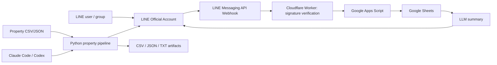

# LINE Sheet Digest + Property Automation

LINE公式アカウントのMessaging APIを安全に使い、Webhook受信・Google Sheets保存・要約通知に加えて、物件情報CSV/JSONをLINE配信用メッセージへ整形する自動化キットです。

> 重要: このリポジトリはLINEの公式APIで許可される範囲だけを対象にします。LINEオープンチャットを非公式にクロールしたり、通常のLINEアカウントを自動操作して投稿・収集する用途は対象外です。OpenChatについては `docs/LINE_API_RESEARCH_ja.md` の制限事項を確認してください。

## できること

- LINE Messaging API WebhookをCloudflare Workerで署名検証して受信
- 対象userId/groupId/roomIdだけをGoogle Apps Scriptへ転送
- Google SheetsへRawログ保存、定期要約、自分のLINEへ通知
- 物件情報CSV/JSONを正規化し、LINEテキスト/Flex Message JSON/CSVへ変換
- LINE公式アカウントAPIの疎通確認、bot info取得、push/broadcastのdry-run/実行
- Claude Code / Codex が迷わず作業できる `CLAUDE.md` / `AGENTS.md` / `CODEX.md`
- GitHub Actionsでテスト、サンプル物件配信データ生成、artifact保存

## 最短利用

```bash
python scripts/validate_env.py --mode local
python scripts/property_pipeline.py --input data/sample_properties.csv --output out --format all
python scripts/line_oa.py bot-info
```

LINEへ実送信する場合は、まず `.env.example` を参考に環境変数またはGitHub Actions Secretsを設定してください。実送信コマンドには `--execute` が必要です。

## 主要ドキュメント

- `docs/LINE_API_RESEARCH_ja.md` — LINE公式アカウントAPI / OpenChat制限 / 初期設定調査
- `docs/SETUP_LINE_ja.md` — 初期設定の文章ガイド
- `docs/VISUAL_SETUP_GUIDE_ja.md` — 画像付きガイダンス
- `docs/PROPERTY_AUTOMATION_ja.md` — 物件情報自動化の運用手順
- `docs/AGENT_GUIDE_ja.md` — Claude Code / Codex向け運用
- `docs/architecture.md` — 全体アーキテクチャ

## アーキテクチャ



## 注意

- OpenChatは、通常のMessaging API Botを招待して自由に投稿・取得できる場所としては扱いません。
- LINEのChannel Secret、Channel Access Token、OpenAI API Key、Google認証情報はGitHubへコミットしないでください。
- 本番実送信は `--execute` を付けたときだけ行います。
