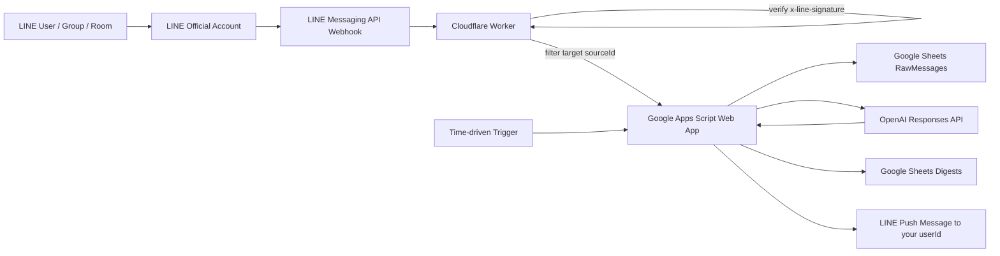

# LINE Sheet Digest

特定のLINEトーク/グループ/ルームに届いた情報をWebhookで自動取得し、Googleスプレッドシートに記録し、一定間隔で要約して自分のLINEへ再通知するためのリポジトリです。

> 注意: LINEの任意チャンネルや過去ログを勝手にクロールする設計ではありません。LINE Messaging APIでBotに届くWebhookイベントを対象にします。対象グループで使う場合はBotを招待し、Botが受信できるメッセージだけを処理します。

## 目的

- LINE Messaging APIのWebhookを安全に受ける
- 対象sourceIdだけをフィルタする
- GoogleスプレッドシートへRawログを残す
- 未処理メッセージを定期的にLLMで要約する
- 要約を自分のLINEユーザーIDへpush通知する
- プロンプトを後で他の自動化GPT/コーディングエージェントへ合併しやすい形で保持する

## 推奨アーキテクチャ



## なぜCloudflare Workerを前段に置くか

LINE Webhookでは `x-line-signature` の検証が推奨されます。一方、Google Apps ScriptのWebアプリは受信ヘッダーを扱いづらいため、GAS単体をWebhook終端にするより、Cloudflare Workerなどの軽量プロキシで署名検証してからGASへ転送する構成が安全です。

## ディレクトリ

```text
.
├── cloudflare-worker/        # LINE署名検証とGAS転送
│   ├── src/index.js
│   ├── test/signature.test.js
│   ├── package.json
│   └── wrangler.toml.example
├── gas/                      # Google Sheets記録・要約・LINE通知
│   ├── Code.gs
│   └── appsscript.json
├── docs/
│   ├── ARCHITECTURE_ja.md
│   ├── SETUP_ja.md
│   ├── SHEET_SCHEMA_ja.md
│   └── PROMPT_MERGE_READY_ja.md
└── .github/workflows/validate.yml
```

## 最短セットアップ

1. LINE DevelopersでMessaging APIチャネルを作る
2. Google Spreadsheetを作り、Apps Scriptに `gas/Code.gs` を貼る
3. Apps Scriptのスクリプトプロパティを設定する
4. Apps ScriptをWebアプリとしてデプロイする
5. Cloudflare Workerをデプロイし、LINEのWebhook URLに設定する
6. 自分のLINEからBotへ `id` と送って userId / groupId / roomId を取得する
7. `TARGET_SOURCE_IDS` に対象sourceIdを設定する
8. Apps Scriptの時間主導トリガーで `runDigest` を定期実行する

詳細は [docs/SETUP_ja.md](./docs/SETUP_ja.md) を参照してください。

## スクリプトプロパティ例

Apps Script 側:

```text
FORWARD_SHARED_TOKEN=ランダムな長い文字列
LINE_CHANNEL_ACCESS_TOKEN=LINEチャネルアクセストークン
OPENAI_API_KEY=OpenAI APIキー
OPENAI_MODEL=gpt-4.1-mini
NOTIFY_TO_USER_ID=自分のLINEユーザーID
TARGET_SOURCE_IDS=対象のuserId/groupId/roomIdをカンマ区切り
DIGEST_WINDOW_HOURS=24
```

Cloudflare Worker 側 secret/vars:

```text
LINE_CHANNEL_SECRET=LINEチャネルシークレット
GAS_WEB_APP_URL=Apps Script Web App URL
FORWARD_SHARED_TOKEN=Apps Script側と同じランダム文字列
TARGET_SOURCE_IDS=対象のuserId/groupId/roomIdをカンマ区切り
```

## 現時点の実装範囲

- テキストメッセージの記録
- follow/join/leaveなどイベントのRaw JSON保存
- `id` / `登録` コマンドでsourceId確認
- 未要約メッセージの一括要約
- 要約結果のSheets保存
- 自分のLINEへのpush通知

## 今後の拡張候補

- 画像/ファイル/音声のmessageIdからコンテンツ取得
- sourceIdごとの別タブ分割
- 要約カテゴリ別のタグ付け
- Google Drive保存
- Slack/メールへの並行通知
- 要約済み行の再処理・ロールバックUI
