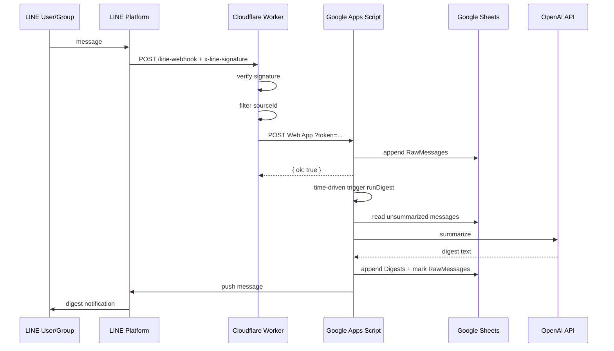

# アーキテクチャ設計

## ゴール

LINE上の特定sourceから届く情報を、以下の順で処理します。

1. LINE Messaging APIがWebhookイベントを送る
2. Cloudflare Workerが署名を検証する
3. 対象sourceIdだけを残す
4. Google Apps Scriptへ転送する
5. GASがGoogle SheetsへRawログを追記する
6. 時間主導トリガーで未処理ログを要約する
7. 要約をSheetsへ保存する
8. LINE Push Messageで自分に通知する

## sourceIdの考え方

LINE Messaging APIのWebhookイベントには、イベント発生元を示す `source` が含まれます。

- 1対1: `source.userId`
- グループ: `source.groupId`
- 複数人トーク/ルーム: `source.roomId`

このリポジトリでは、これらを総称して `sourceId` と呼びます。

`TARGET_SOURCE_IDS` にカンマ区切りで対象IDを設定すると、それ以外のイベントは破棄します。

## セキュリティ境界

### Cloudflare Worker

- LINEの `x-line-signature` を検証する
- 検証失敗イベントはGASへ転送しない
- GASへ転送する際は `FORWARD_SHARED_TOKEN` をクエリパラメータで付与する

### Google Apps Script

- `FORWARD_SHARED_TOKEN` が一致しないPOSTを拒否する
- GAS側でも `TARGET_SOURCE_IDS` を再確認する
- APIキーやアクセストークンはスクリプトプロパティに保存する

## なぜGAS単体Webhookにしないか

LINEの署名検証には受信ヘッダー `x-line-signature` が必要です。Google Apps ScriptのWebアプリはリクエストヘッダーを標準的に扱いづらいため、Webhook終端をGASに直結すると署名検証が弱くなります。そこで、Webhook終端はCloudflare Workerにして、検証済みイベントだけをGASへ流します。

## データフロー

## 運用上の制約

- Botが受信していない過去メッセージは取得できません。
- LINE公式アカウントが参加していないグループ/ルームの内容は取得できません。
- 画像/動画/音声/ファイルはmessageIdから追加取得する拡張が必要です。
- Push MessageはLINE Messaging APIの利用枠/料金/制限に従います。
- OpenAI APIの利用には別途APIキーと利用料金が必要です。

## MVP構成

| レイヤー | 採用技術 | 理由 |
|---|---|---|
| Webhook終端 | Cloudflare Worker | 署名検証・軽量・無料枠運用しやすい |
| 保存先 | Google Sheets | 非エンジニアでも確認しやすい |
| 処理実行 | Google Apps Script | Sheets操作と定期実行が簡単 |
| 要約 | OpenAI Responses API | プロンプト管理しやすい |
| 通知 | LINE Messaging API Push | 自分のLINEに戻せる |
