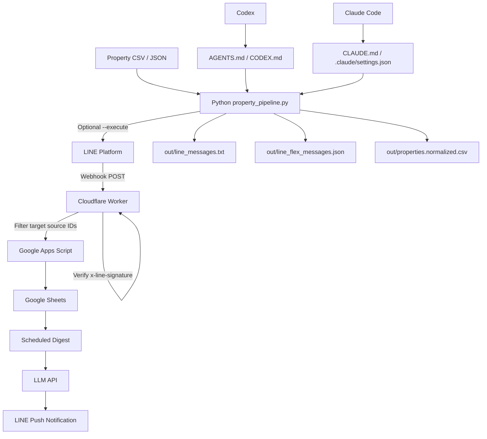

# Architecture

## Overview

This repository combines the original LINE Sheet Digest webhook pipeline with a property information automation kit.

- Front door: Cloudflare Worker receives LINE webhook requests and verifies `x-line-signature`.
- Storage/digest: Google Apps Script stores raw events in Google Sheets and can summarize them on a schedule.
- Property automation: Python scripts normalize property CSV/JSON and generate LINE text/Flex Message outputs.
- AI operation: `AGENTS.md`, `CODEX.md`, and `CLAUDE.md` define safe behavior for Codex and Claude Code.
- CI/CD: GitHub Actions runs Node and Python tests and uploads generated sample artifacts.

## Mermaid

## Security boundaries

- All LINE calls are dry-run by default.
- Real sending requires `--execute` and `LINE_DRY_RUN=false`.
- Secrets are referenced by name only and must be stored in GitHub Actions Secrets, Cloudflare secrets, GAS properties, or local environment variables.
- OpenChat scraping or personal LINE client automation is out of scope.

## Main components

| Component | Path | Purpose |
|---|---|---|
| Cloudflare Worker | `cloudflare-worker/src/index.js` | Webhook verification and forwarding |
| GAS | `gas/Code.gs` | Sheets storage, digest, push notification |
| Property model | `src/line_property_automation/property_model.py` | Normalize property records and create messages |
| LINE client | `src/line_property_automation/line_client.py` | Official Messaging API helper |
| Property CLI | `scripts/property_pipeline.py` | Generate outputs and optional push |
| LINE CLI | `scripts/line_oa.py` | Bot info, quota, push, broadcast helpers |
| CI | `.github/workflows/validate.yml` | Test and artifact generation |
